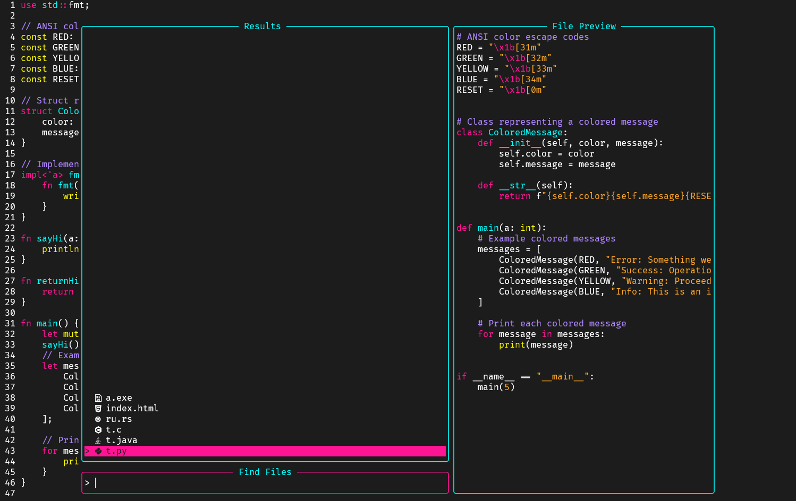

# NeoM

This is a personal colorscheme project that will be updated from time to time until I'm satisfied with it.
The goal is to have a neon colorscheme that is easy on the eyes (as good as possible) and has a good contrast.

## Installation
**Change branch to "dev" if you want the latest version**

### Packer


```lua
use {
        'dubskysteam/neom',
        branch = 'main',
        config = function()
            vim.cmd('colorscheme neom')
        end
    }
```

### Vim-Plug

```lua
Plug 'dubskysteam/neom', {
    'branch': 'main',
    'do': { -> vim.cmd('colorscheme neom') }
}
```

## TODO

- [ ] Re-write in lua
- [ ] Fix specific language highlights (C, Python, Java etc.)
- [X] Include more plugin specific highlights (Mason, Telescope, LSP etc.)
- [X] Improve contrasts (Will never really be finished)

## Screenshots

**Using LSPZ + Rust**

**Using Telescope**

