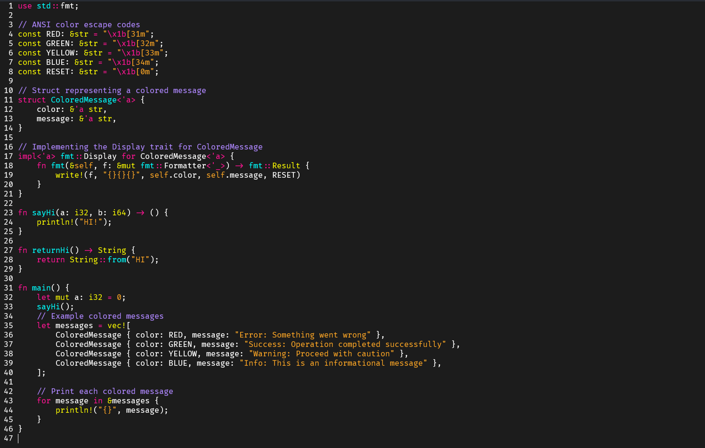
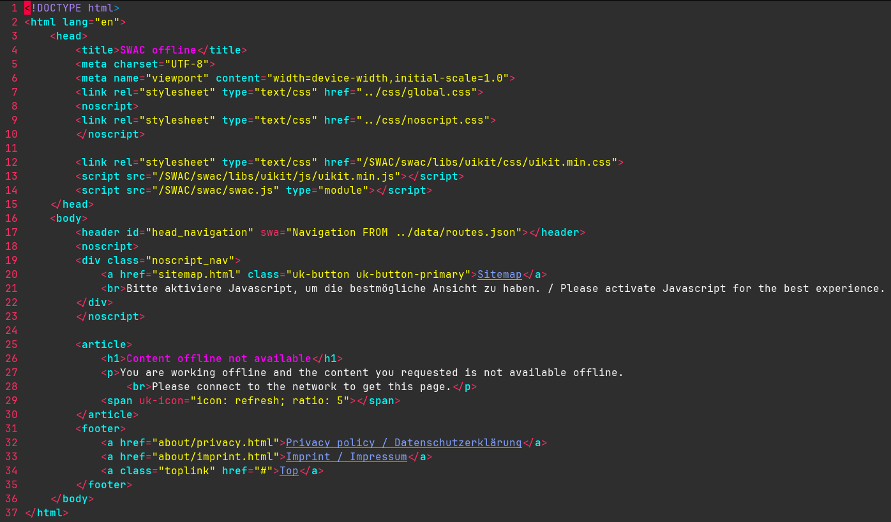

# NeoM

```
This is a personal colorscheme project that will be updated from time to time until I'm satisfied with it.
```

## Installation

###  Packer.nvim

```lua
use {
        'dubskysteam/neom',
        branch = 'main', -- You can change this to dev if you want to use the lastest version
        config = function()
            vim.cmd('colorscheme neom')
        end
    }
```

## TODO

- [ ] Re-write in lua
- [ ] Improve contrasts (colorscheme in general)
- [ ] Include more plugin specific highlights (Mason, Telescope, LSP etc.)

## Screenshots



